# ROADMAP

Ordem dos módulos, gates de fechamento, e por que essa sequência.

Sem datas. Cada módulo dura o que precisar.

---

## Sequência

```mermaid
flowchart TD
    subgraph Fundacional["Fundacional — não-negociável"]
        M1["01 · Foundations<br/><i>estrutura, config, shutdown limpo</i>"]
        M2["02 · Testing pyramid + TDD Chicago<br/><i>testar antes de implementar</i>"]
    end

    subgraph Núcleo["Núcleo — patterns que sustentam o ledger"]
        M3["03 · Concurrency & parallelism"]
        M4["04 · Error handling & resilience"]
        M5["05 · Observability"]
        M6["06 · Persistence patterns"]
        M7["07 · Messaging & event-driven"]
        M8["08 · HTTP & API design"]
    end

    subgraph CrossCutting["Cross-cutting — revisão do todo"]
        M9["09 · Security"]
        M10["10 · Performance & profiling"]
    end

    subgraph Consolidação["Consolidação — produção e teoria"]
        M11["11 · Cloud-native deployment"]
        M12["12 · Distributed systems fundamentals"]
        M13["13 · Capstone & integração final<br/><i>deploy GCP + load test + relatório</i>"]
    end

    subgraph FaseFinal["Fase final — aplicação no mundo real"]
        Contrib["Contribuição Real<br/><i>1+ PR mergeado em projeto OSS</i>"]
    end

    M1 --> M2 --> M3 --> M4
    M4 -.->|"ledger feature-complete a partir daqui"| M5
    M5 --> M6 --> M7 --> M8 --> M9 --> M10 --> M11 --> M12 --> M13
    M13 --> Contrib

    classDef foundational fill:#1e3a8a,stroke:#1e40af,color:#fff
    classDef core fill:#065f46,stroke:#047857,color:#fff
    classDef crosscut fill:#7c2d12,stroke:#9a3412,color:#fff
    classDef final fill:#581c87,stroke:#6b21a8,color:#fff
    classDef realworld fill:#9a3412,stroke:#c2410c,color:#fff

    class M1,M2 foundational
    class M3,M4,M5,M6,M7,M8 core
    class M9,M10 crosscut
    class M11,M12,M13 final
    class Contrib realworld
```

---

## Por que essa ordem

**1-2 são fundacionais e não-negociáveis.** Não dá pra fazer 3+ sem ter
projeto estruturado e teste rodando. Vira castelo de cartas.

**3 (concorrência) vem antes de 4 (resilience)** porque retry, breaker e
DLQ existem PRA lidar com cenário concorrente. Sem entender concorrência,
patterns de resilience viram receita.

**5 (observability) entra cedo, antes de persistência e mensageria**, pra
que toda feature adicionada de 6+ já nasça observável. Adicionar
instrumentação depois é o anti-pattern padrão. Aqui aprendemos a fazer
desde o início.

**6-7 (persistence + messaging)** são a parte densa de patterns reais
(idempotency, outbox, saga, DLQ). Precisam dos 5 anteriores como base.

**8 (HTTP & API design)** vem depois de mensageria porque idempotency-key
na borda HTTP é prima da idempotência interna. Faz mais sentido depois de
ter visto o pattern duas vezes.

**9-10 (security + performance)** são cross-cutting — aplicam revisão em
tudo que já foi construído. Não fazem sentido como primeiros módulos.

**11 (deployment)** consolida toda a stack em container distroless +
cluster local k3d. Precisa ter app completo pra fazer sentido.

**12 (distributed systems)** entra perto do fim porque é o módulo mais
teórico. Faz mais sentido depois de ter sentido na pele os problemas
(idempotency, partial failure, latência cauda) — aí a teoria explica o
que já se viveu.

**13 (capstone)** valida o todo.

---

## Gates de fechamento por módulo

Não pode avançar pro módulo N+1 sem fechar N. "Fechar" significa:

| Gate                                          | Como validar                                                                            |
| --------------------------------------------- | --------------------------------------------------------------------------------------- |
| Implementação Go verde                        | `go test ./...` passa, `go vet ./...` limpo, `golangci-lint run` limpo                  |
| Implementação Node verde                      | `pnpm test` passa, `pnpm lint` limpo, `pnpm typecheck` limpo                            |
| README do módulo escrito em palavras próprias | Não é copy do SYLLABUS. Tem que ser reescrito                                           |
| COMPARISON.md preenchido                      | Pelo menos 3 trade-offs reais Go vs Node listados                                       |
| Assessment respondido honestamente            | `docs/assessments/NN-*.md` preenchido — incluindo "ainda não sei X"                     |
| Apresentação dada sem notas                   | Para outra pessoa do time (ou gravada). Mínimo 15 minutos cobrindo o conceito do módulo |
| 7 perguntas de calibração — as do módulo      | Respondidas em < 90s cada, em voz alta                                                  |

Se um item está cinza, o módulo não está fechado. Pode passar dias parado.
Travar é sinal de absorção em curso, não de falha.

---

## Recomendação de cadência

Cada equipe (ou cada pessoa) tem ritmo próprio. Como referência:

| Cenário                                       | Cadência típica                                |
| --------------------------------------------- | ---------------------------------------------- |
| Tempo dedicado (~10-15h/semana)               | 1 módulo a cada 1-2 semanas, ~4-5 meses total  |
| Tempo limitado (~5h/semana)                   | 1 módulo a cada 3-4 semanas, ~8-10 meses total |
| Time inteiro em uma sala (workshop intensivo) | 1 módulo por dia, 13 dias úteis                |

**Não force**. Avançar com gate aberto vira regressão garantida no módulo
seguinte.

---

## Como tratar interrupção

Vai acontecer. Sprint apertada, incidente em produção, viagem.

- **Pausa < 1 semana**: retoma do ponto onde parou. Sem ritual.
- **Pausa 1-4 semanas**: revisa o último módulo fechado (lê o README,
  responde as perguntas de calibração de novo). Se passar, segue. Se
  travar, repita esse módulo.
- **Pausa > 1 mês**: re-faz o último módulo do zero. Não é regressão, é
  consolidação. O que foi absorvido vai voltar rápido. O que não foi,
  você vai descobrir agora — bom sinal.

---

## Fase final — Contribuição Real (pós-módulo 13)

O curso não termina no módulo 13. Termina quando o aluno **aplica o que
aprendeu num projeto open source de verdade**.

Depois de operar o repositório-curso de ponta a ponta — issues, PRs,
milestones, releases, deploy, load test — o aluno domina o ritual da
engenharia colaborativa. A Fase Final transforma "eu acho que conseguiria
contribuir" em "eu contribuí, está mergeado, aqui está o link".

**Entregável**: pelo menos **1 contribuição real mergeada** num projeto
open source de verdade — tipicamente uma `good first issue` num projeto
CNCF, ou uma correção de documentação/bug num repositório que o aluno usa.

**Por que isso fecha o curso**: a maioria dos desenvolvedores não trava na
contribuição OSS por falta de habilidade técnica — trava por não conhecer
o ritual (ler `CONTRIBUTING.md`, pegar issue, abrir PR no padrão, passar
por review, respeitar o ciclo de release). O curso inteiro treinou esse
ritual num ambiente controlado; a Fase Final é a aplicação no mundo real.

### Portfólio com que o aluno termina

1. **O repositório do curso completo** — fork dele: 13 módulos, gitflow
   limpo, releases, board fechado, `v1.0.0` publicada.
2. **O relatório de load test** do deploy no GCP — artefato técnico de
   nível sênior, defensável numa entrevista.
3. **1+ PR mergeado** em projeto open source real — prova de colaboração.

Os três juntos são um portfólio concreto: não "eu sei", e sim "eu fiz,
está aqui".

---

## Saída do roadmap

Ao fechar o módulo 13 e a Fase Final, o aluno:

- Implementou e operou um ledger transacional em Go e Node.
- Discutiu trade-offs reais em pelo menos 13 pontos do sistema.
- Levou o sistema a produção no GCP e validou com load test profissional.
- Documentou postmortem, ADRs, relatório técnico e self-scorecard honesto.
- Operou o ferramental completo do GitHub — issues, milestones, board,
  releases, packages, design docs.
- Fez ao menos uma contribuição real mergeada em projeto open source.

O que vem depois fica em aberto. Não é continuação obrigatória — é base
sólida pra escolher próxima direção (system design profundo, observabilidade
avançada, distributed systems advanced, plataforma interna). Esse curso
prepara pra escolher, não escolhe.
